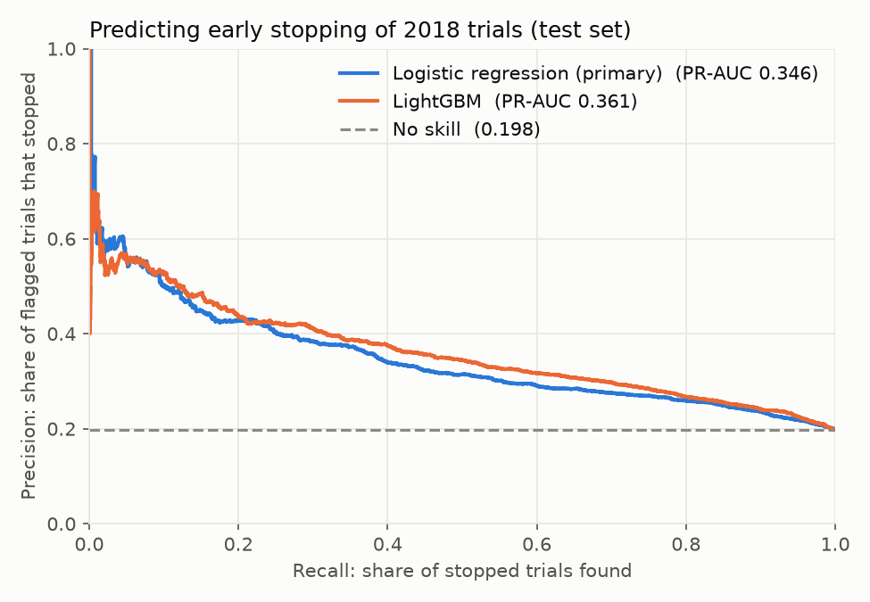
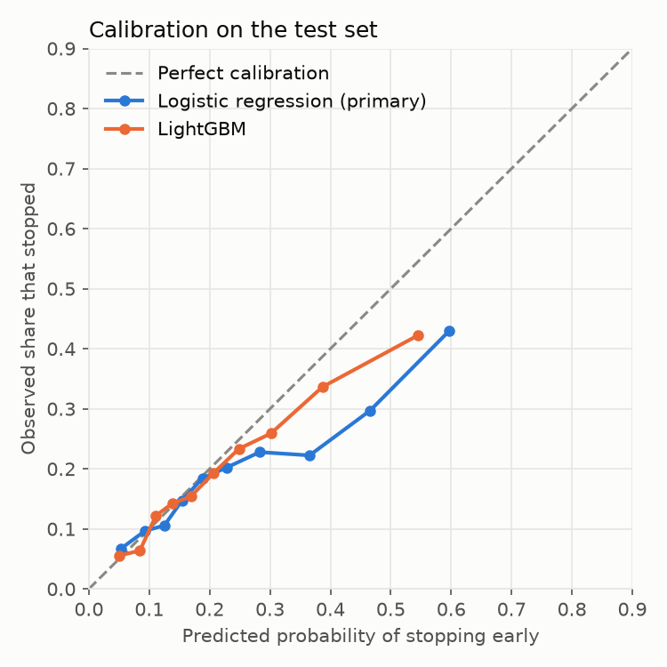

# Predicting clinical trial termination

> Status: ✅ v1 complete: cohort, 41 registration features, baselines, LightGBM, and a single evaluation on held-out 2018 trials.

Can we tell early, using only what a trial's public registration says, whether it will stop before it finishes?

## Results at a glance

Trained on trials registered up to 2017, tested **once** on **10,970 trials registered in 2018** that the models never saw (19.8% of them later stopped early):

| Model | PR-AUC (95% CI) | ROC-AUC | Brier |
|---|---|---|---|
| No model (predict the stop rate) | 0.198 | 0.500 | 0.159 |
| Logistic regression (pre-declared primary) | 0.346 (0.329–0.367) | 0.676 | 0.156 |
| LightGBM | **0.361** (0.343–0.381) | **0.698** | **0.148** |

- **Registration data alone predicts early stopping about 1.8× better than chance** (PR-AUC 0.35–0.36 vs 0.198).
- **The riskiest 10% of trials, as ranked by the model, stopped early 42.9% of the time**, 2.2× the average. The riskiest 5% stopped 48.5% of the time (2.45×).
- **LightGBM is slightly but reliably better** on the test set (PR-AUC +0.015, bootstrap 95% CI +0.005 to +0.025), and its probabilities are better calibrated.



## Problem statement

**Question.** Using only information publicly available on ClinicalTrials.gov in **December 2018**, predict which trials that had not yet finished recruiting will end up **terminated or withdrawn** rather than **completed**.

**Why it matters.** Trials that stop early waste funding and expose patients to research that produces no answer. Sponsors and CROs spend a lot of effort deciding whether a trial is likely to recruit and finish. A model that flags high-risk trials at registration time could support that decision.

**Design ("time machine").** Two monthly snapshots of the AACT database:
- **Dec 2018 snapshot → features.** Everything the model sees comes from this snapshot, so it only knows what was knowable at the time.
- **Sep 2026 snapshot → outcome.** The same trials (matched on `nct_id`), about 8 years later.

**Population.**
- Interventional trials
- with status *Not yet recruiting* or *Recruiting* in the Dec 2018 snapshot.

**Outcome (from the Sep 2026 snapshot).**
- Positive (1): *Terminated* or *Withdrawn*
- Negative (0): *Completed*

**Excluded, then counted and reported (not dropped silently):**
- trials still ongoing in 2026 (recruiting, active, enrolling by invitation, not yet recruiting)
- *Suspended*, *Unknown status* and other statuses (e.g. expanded access)
- trials that can't be found in the 2026 snapshot

**Evaluation.**
- Time-based split by registration year: **train ≤ 2016, validation 2017, test 2018**. No random split. The test set is used once, at the end.
- Metrics: PR-AUC (the positive class is the minority), ROC-AUC, and calibration.

**Baselines to beat.**
1. Predict the majority class for every trial.
2. Logistic regression on trial phase and sponsor type only.

### Decisions (made after exploring the data, 28 Sep 2026)
- [x] **Withdrawn and Terminated form one positive class** ("stopped early"). Withdrawn trials come almost entirely from trials that were *not yet recruiting* in 2018 (10.6% of them, vs 1.5% of recruiting trials). So the 2018 status is kept as a feature, and results are also reported **for 2018-recruiting trials only**, to show the model isn't just learning "not yet recruiting → withdrawn".
- [x] **Unknown status is excluded from the main analysis**, and a **sensitivity check** counts it as stopped early (`label_sensitivity`). It's 24% of the cohort, so this is the largest threat to validity (see Limitations).
- [x] **Split by registration year:** train ≤ 2016, validation 2017, test 2018. The stopped-early rate is stable at about 20% across 2012–2018, so the split isn't distorted by a changing base rate.

## Cohort

Built in [`sql/05_cohort_view.sql`](sql/05_cohort_view.sql) as the view `analysis.cohort` (one row per trial). Every column and status is explained in [`docs/cohort_guide.md`](docs/cohort_guide.md).

| Group (status in Sep 2026) | Trials | |
|---|---|---|
| **Cohort**: interventional, recruiting or not yet recruiting in Dec 2018 | **47,210** | 100% |
| Completed → label 0 | 25,420 | 53.8% |
| Terminated → label 1 | 4,846 | 10.3% |
| Withdrawn → label 1 | 1,637 | 3.5% |
| Unknown status → excluded | 11,326 | 24.0% |
| Still ongoing or other → excluded | 3,711 | 7.9% |
| Suspended → excluded | 207 | 0.4% |
| Not found in 2026 → excluded | 63 | 0.1% |
| **Labelled trials used for modelling** | **31,903** | 20.3% positive |

| Split | Registered | Labelled trials |
|---|---|---|
| train | ≤ 2016 | 11,776 |
| validation | 2017 | 9,157 |
| test | 2018 | 10,970 |

With about 20% positives, a random classifier scores a **PR-AUC of about 0.20**. That's the reference point for every result.

## Data

[AACT](https://aact.ctti-clinicaltrials.org/) (Aggregate Analysis of ClinicalTrials.gov), from the Clinical Trials Transformation Initiative. Monthly PostgreSQL snapshots:

| Snapshot | Studies |
|---|---|
| Dec 2018 | 291,109 |
| Sep 2026 | 604,561 |

The data isn't included in this repo because it's too large. See **Setup** to rebuild it locally. Data issues found along the way are recorded in [`docs/data_quality_log.md`](docs/data_quality_log.md). Candidate features and the leakage review are in [`docs/feature_list.md`](docs/feature_list.md).

## Repository structure

In the database, the raw snapshots live in the schemas `snap_2018_12` and `snap_2026_09`, and the cleaned layer built by this project lives in `analysis`.

```
sql/              SQL queries (exploration, cohort, features)
notebooks/        exploration and modelling notebooks
src/              reusable Python code
reports/figures/  saved plots
docs/             data-quality log and notes
```

## Setup

1. Install PostgreSQL (version 14 or newer).
2. From AACT, download the **Dec 2018** and **Sep 2026** PostgreSQL dump snapshots.
3. Restore both into one database, then rename each schema:
   ```
   createdb -U postgres aact
   pg_restore -U postgres -d aact --no-owner --no-privileges <2018 dump>
   psql -U postgres -d aact -c "ALTER SCHEMA ctgov RENAME TO snap_2018_12;"
   pg_restore -U postgres -d aact --no-owner --no-privileges <2026 dump>
   psql -U postgres -d aact -c "ALTER SCHEMA ctgov RENAME TO snap_2026_09;"
   ```
4. Create the Python environment (Python 3.12+):
   ```
   python -m venv .venv
   .venv\Scripts\activate          # Windows  (macOS/Linux: source .venv/bin/activate)
   pip install -r requirements.txt
   ```
5. Copy `.env.example` to `.env` and fill in your database password.
6. Create the analysis layer: run `sql/05_cohort_view.sql` once against the `aact` database.

## Results so far: baselines (validation set, 2017 registrations)

Trained on trials registered up to 2016, scored on trials registered in 2017 (9,157 trials, 20.2% stopped early). The test set (2018) hasn't been used yet. See [`notebooks/03_baselines.ipynb`](notebooks/03_baselines.ipynb).

| Model | PR-AUC | ROC-AUC | Brier |
|---|---|---|---|
| 0 · No model (predict the stop rate) | 0.202 | 0.500 | 0.161 |
| 1 · Logistic regression, `phase` + lead sponsor type | 0.248 | 0.582 | 0.159 |
| **2 · Logistic regression, all 38 features** | **0.383** | **0.695** | **0.148** |

**What this shows:**
- **Registration data alone carries a real but moderate signal.** With all features, PR-AUC nearly doubles compared with no model (0.38 vs 0.20). The two-feature model adds little, so most of the signal comes from the other features.
- **No sign of leakage.** The scores are well below "too good to be true" for registry-only information.
- **The strongest signals (coefficients, which show association, not cause):**
  - towards *stopped early*: not yet recruiting in 2018, industry lead sponsor, a US site, being registered long before the start date
  - towards *completed*: already recruiting, behavioural interventions, NIH or U.S. federal sponsors, health-services research, more sites
- **Robustness:** on trials already recruiting in 2018 (8,050 trials, 17.3% stopped), the model still reaches PR-AUC 0.283 against a base rate of 0.173 (ROC-AUC 0.662). It isn't only learning "not yet recruiting → withdrawn", although the signal is weaker in that group.
- **One surprise to investigate:** `overdue_2018` (still recruiting past the planned completion date) leans towards *completed*, not stopped.

## Model comparison (validation set, 2017 registrations)

See [`notebooks/04_model.ipynb`](notebooks/04_model.ipynb). 41 features (the 3 eligibility-criteria features were added after the literature review below, before any test scoring).

| Model | PR-AUC | ROC-AUC | Brier |
|---|---|---|---|
| Logistic regression, all features | 0.383 | 0.696 | 0.148 |
| LightGBM, standard settings | 0.378 | 0.695 | 0.149 |
| LightGBM, tuned (best of 18 settings) | 0.391 | 0.708 | 0.146 |

- **Gradient boosting barely beat logistic regression on validation** (+0.008 PR-AUC). The signal in registry features is mostly simple and additive.
- **The eligibility-criteria features are used** (word count is the 5th most important feature for LightGBM) but **added almost nothing** to the scores (logistic regression 0.383 → 0.383, LightGBM 0.389 → 0.391).
- **Robust to the unknown-status problem:** with unknown trials counted as stopped, PR-AUC is 0.660 vs a base rate of 0.433.
- **Trials overdue in 2018** (still active after their planned end) stopped *less* often, within both 2018 statuses (e.g. 41.6% vs 66.5% among not-yet-recruiting trials).
- **Decided before touching the test set:** logistic regression is the primary model, and LightGBM is also reported.

## Final evaluation (test set, 2018 registrations)

See [`notebooks/05_final_evaluation.ipynb`](notebooks/05_final_evaluation.ipynb). Both models were retrained on train + validation (20,933 trials) with their settings unchanged, then scored once.

- **Test scores are lower than validation** (logistic regression 0.383 → 0.346, LightGBM 0.391 → 0.361). The model generalises to a new year of trials, but less well than validation suggested.
- **LightGBM beats the pre-declared primary model on test** (+0.015 PR-AUC, 95% CI +0.005 to +0.025; ROC-AUC 0.698 vs 0.676). This is reported as observed. If the model were deployed, LightGBM would be the one to use.
- **Trials already recruiting in 2018:** PR-AUC 0.271 (logistic regression) / 0.290 (LightGBM) vs a base rate of 0.158. The signal holds beyond "not yet recruiting → withdrawn".
- **Calibration drifts on the new year:** for the riskiest trials, logistic regression predicts 37–60% but only 22–43% stopped. LightGBM is closer (Brier 0.148 vs 0.156). **The ranking holds up, but the probabilities would need re-calibrating on recent trials before use.**
- **Likely reason for the drop:** "not yet recruiting in Dec 2018" means something different for a trial registered in 2018 (it has just been registered) than for one registered in 2014 (it's years late). The model learned the second meaning from older trials and over-applies it to new ones. The small drop within already-recruiting trials is consistent with this.



## Related work, and how this project differs

| Study | Data and split | Best result |
|---|---|---|
| [Elkin & Zhu 2021, *Sci Rep*](https://www.nature.com/articles/s41598-021-82840-x) | 68,999 completed/terminated trials, **one 2019 snapshot, random cross-validation**; 40 structured features + keywords + text embeddings | ROC-AUC > 0.73 |
| [Accrual-failure prediction 2025, *Sci Rep*](https://www.nature.com/articles/s41598-025-88400-x) | 57,846 US trials (termination for low accrual), **time-based ("pseudo-prospective") validation**; 87 design features + text | ROC-AUC 0.737 (design features alone ≈ the same) |
| This project | 31,903 trials; **features frozen as they were in Dec 2018, outcome from 2026**, split by registration year; withdrawn trials included | ROC-AUC 0.70–0.71 (validation), **0.68–0.70 (2018 test)** |

**What was adopted from this work:** both studies found **eligibility-criteria complexity** among the strongest registry signals, so three criteria features were added (word count, number of inclusion and number of exclusion criteria) *before* the test set was used. Both studies also found text embeddings add little over structured design features, so full-text NLP is left for v2.

**Why the scores aren't directly comparable:** a random split mixes old and new trials, and a single current snapshot can contain information updated *after* the outcome (e.g. edited dates or site lists). This project's "time machine" design and year-based split are stricter, so a slightly lower score is expected and more honest.

## Limitations
- **Trial "age" at the snapshot differs across splits.** Older trials in the cohort were still recruiting years after registration, while 2018 trials were brand new. This shifts what features like `status_2018` mean, and it's the likely cause of the calibration drift on the test set.
- **Probabilities need re-calibration** on recent data before being used as risk estimates. The ranking is more reliable than the exact percentages.
- **Unknown status (24% of the cohort) is excluded** from the main label. The sensitivity check suggests the conclusions don't depend on this.
- **Unknown status (24% of the cohort).** These trials stopped being updated, and many are probably abandoned. Excluding them likely makes the stopped-early rate look lower than it is. A sensitivity check addresses this.
- **Still-ongoing trials are excluded (7.9%).** Trials that are still running after 8 years are left out, so the labelled set leans towards shorter trials.
- **Features are the registry's contents**, not the sponsor's internal plans, so the model can only use what was made public.

## Roadmap
- [x] Week 1: explore both snapshots; table of how 2018 statuses ended up in 2026; cohort and label view
- [x] Week 2: features (2018 snapshot only), leakage check, baselines (best PR-AUC 0.383 on validation)
- [x] Week 3: literature review, LightGBM, checks, single test evaluation, write-up (test PR-AUC 0.361 / ROC-AUC 0.698)

### Ideas for v2
- Add "time since registration" at the snapshot, or build the cohort at a fixed trial age, to remove the trial-age drift.
- Re-calibrate the probabilities (e.g. isotonic regression on the most recent year).
- Add more cutoff years (e.g. Dec 2017, Dec 2019), with a COVID-era stress test.
- Text features from the eligibility criteria and descriptions (embeddings).
- A small API or dashboard that scores a registered trial.
